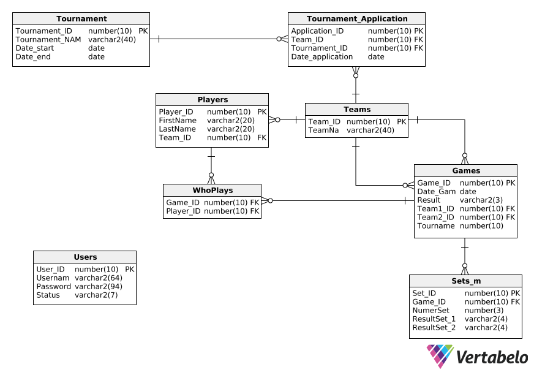

# projekt_bd




### Tunelowanie sie do hosta labora.mimuw.edu.pl 

```
ssh -N -f -L localhost:1521:labora.mimuw.edu.pl:1521 user@students.mimuw.edu.pl
```

### Fixtures: 
https://pl.wikipedia.org/wiki/Memoria%C5%82_Huberta_Jerzego_Wagnera_2018

### instalacja 
http://www.indjango.com/ubuntu-install-postgresql-and-pgadmin/
https://www.digitalocean.com/community/tutorials/how-to-install-and-use-postgresql-on-ubuntu-18-04


### Problem z instalacją sqlDevelopera:
```
/home/<user>/.sqldeveloper/19.1.0
```
```
SetJavaHome /usr/lib/jvm/java-8-openjdk-amd64
```
Uwaga na 11 może nie działać! 
